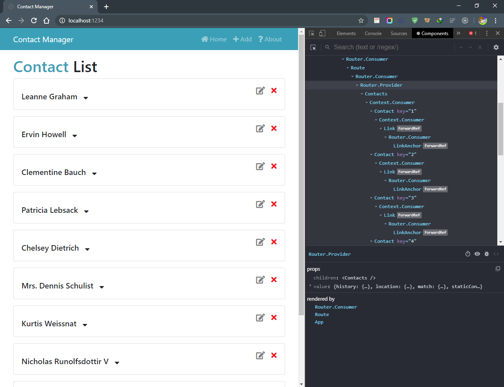

# Contact Manager - React Tutorial



Original Source : [Brad Traversy (Traversy Media)](https://www.traversymedia.com/)

- - -

The template project for [nano-react-app](https://github.com/adrianmcli/nano-react-app).

- `npm start` — This will spawn a development server with a default port of `1234`.
- `npm run build` — This will output a production build in the `dist` directory.

## Custom port

You can use the `-p` flag to specify a port for development. To do this, you can either run `npm start` with an additional flag:

```
npm start -- -p 3000
```

Or edit the `start` script directly:

```
parcel index.html -p 3000
```

## Adding styles

You can use CSS files with simple ES2015 `import` statements in your Javascript:

```js
import "./index.css";
```

## Babel transforms

The Babel preset [babel-preset-nano-react-app](https://github.com/adrianmcli/babel-preset-nano-react-app) and a small amount of configuration is used to support the same transforms that Create React App supports.

The Babel configuration lives inside `package.json` and will override an external `.babelrc` file, so if you want to use `.babelrc` remember to delete the `babel` property inside `package.json`.


## Deploy to GitHub Pages

You can also deploy your project using GitHub pages.
First install the gh-pages package:

`npm i -D gh-pages`

With Parcel's --public-url flag, use the following scripts for deployment:

```
"scripts": {
		"start": "parcel index.html",
		"build": "parcel build index.html --public-url '.'",
		"predeploy": "rm -rf dist && parcel build index.html --public-url '.'",
		"deploy": "gh-pages -d dist"
	},
```

Then follow the normal procedure in GitHub Pages and select the `gh-pages` branch.
